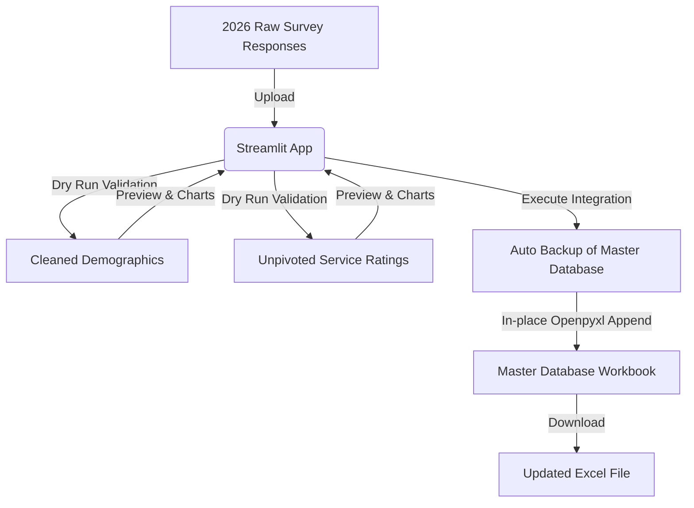

# ISN Survey Data Cleaning & Integration Hub

An automated data cleaning and integration tool built with Python and Streamlit to process, normalize, and merge annual satisfaction survey responses into the historical master database at the National Sports Institute of Malaysia (ISN).

This project transitions and automates complex multi-step data pipelines previously managed in Excel Power Queries into a modern, pure-Python script.

## 📊 Workflow & Architecture



## 🌟 Key Features

- **Demographic Normalization**: Automatically extracts clean, English demographic values by separating bilingual strings (e.g. `Male / Lelaki` -> `Male`). Normalizes age values (e.g. `Below 18 / Bawah 18` -> `<18`) for consistency across historical years.
- **String to Numeric Rating Cleaning**: Parses descriptive rating options (e.g., `5 - Very Satisfied / Sangat puas hati`) into standard integers (`5`). Maps empty or `"N/A"` responses to `0` to align with base metrics.
- **Schema Compatibility**: Handles new services dynamically. For example, in 2026, the tool automatically inserts a new column for **Sports Massage Therapy** into the pivoted Sports Medicine sheet and integrates it into the unpivoted dataset.
- **Historic Power Query Replicability**: Maintains exact database consistency, replicating structural M-code behaviors (including specific legacy column naming and mapping quirks).
- **Auto-Backup System**: Creates an automatic timestamped backup of the master database (e.g., `.bak_YYYYMMDD_HHMMSS`) before making any updates.
- **Dynamic Preview & Insights**: Allows users to preview processed datasets (both pivoted and unpivoted) and view summary charts before committing data to the database.

---

## 📁 Repository Structure

```text
├── PowerQuery files/
│   ├── PowerQuery Survey Data Cleaning Process_m_code.txt       # Process workbook M-code
│   └── PowerQuery Survey Data Cleaning Source Data_m_code.txt    # Source data workbook M-code
├── app.py                                                        # Streamlit application dashboard
├── requirements.txt                                              # Python dependencies
├── .gitignore                                                    # Excludes local data/excel files
└── README.md                                                     # Project documentation
```

> [!IMPORTANT]
> The raw survey responses and the master database contain sensitive Personal Identifiable Information (PII) such as email addresses, ages, and personal opinions of athletes and coaches. These datasets are excluded from Git version control via `.gitignore` to preserve privacy.

---

## 🚀 Installation & Usage

### Prerequisites
- Python 3.8 or above installed.

### 1. Clone the Repository
```bash
git clone https://github.com/niwlaash/ISN-Survey-Data-Cleaning.git
cd ISN-Survey-Data-Cleaning
```

### 2. Install Dependencies
```bash
pip install -r requirements.txt
```

### 3. Launch the Application
```bash
streamlit run app.py
```

Open the local address printed in your terminal (typically `http://localhost:8501`) to access the interface.

---

## 🛠 Technology Stack
- **Core**: Python
- **Interface**: Streamlit
- **Data Manipulation**: Pandas, Numpy
- **Excel File I/O**: Openpyxl (chosen to append data while preserving existing styles and formats)

---
*Created and maintained by the National Sports Institute of Malaysia (ISN).*
